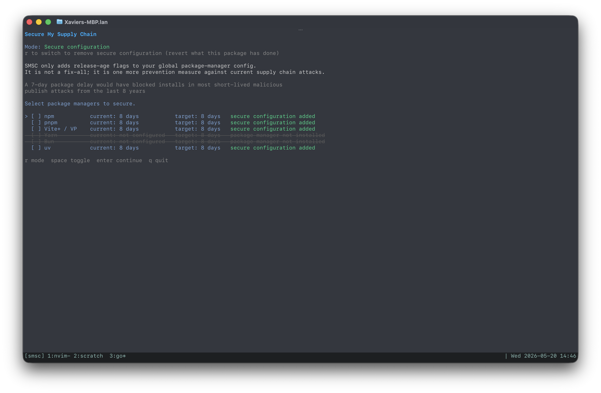

# SMSC: Secure My Supply Chain

[](https://github.com/xavier-castro/smsc/actions/workflows/ci.yml)
[](https://github.com/xavier-castro/smsc/actions/workflows/security.yml)
[](https://github.com/xavier-castro/smsc/actions/workflows/release.yml)
[](LICENSE)



`smsc` is a small terminal UI and CLI for individual developers who want global package-manager release-age policies. It delays installation of very new package versions by writing the minimum release-age settings supported by your installed package managers.

SMSC is deliberately scoped:

- **For individual developer machines.** It is not a team-policy server or CI enforcement system.
- **Global config only.** It writes user/global package-manager config files and never changes project-local config.
- **One supply-chain layer.** Release-age gates can reduce exposure to fast-moving malicious publishes, but they do not replace lockfiles, review, provenance, vulnerability scanning, or least-privilege tokens.

The default recommendation is **8 days**.

## Install

### Homebrew release path

```sh
brew tap xavier-castro/smsc
brew install smsc
smsc --version
```

### Go install

```sh
go install github.com/xavier-castro/smsc/cmd/smsc@latest
smsc --version
```

### Build locally from source

```sh
git clone https://github.com/xavier-castro/smsc.git
cd smsc
go test ./...
go build ./cmd/smsc
./smsc --dry-run
```

Release archives are produced by GoReleaser for macOS and Linux on `amd64` and `arm64`. Verify downloaded archives with the published `checksums.txt` file.

## Quick start

Open the TUI:

```sh
smsc
```

Preview planned global config changes:

```sh
smsc --dry-run
```

Apply the recommended 8-day policy non-interactively:

```sh
smsc --days 8 --managers all --yes
smsc --days 8 --save-tilde --managers npm,pnpm --yes
```

Inspect machine state and local override warnings:

```sh
smsc doctor
```

List backups and restore the latest backup:

```sh
smsc backups
smsc restore latest --dry-run
smsc restore latest --yes
```

Remove SMSC-managed release-age configuration:

```sh
smsc --remove --managers all --yes
```

Emit machine-readable output:

```sh
smsc --json --dry-run
smsc doctor --json
smsc backups --json
```

## Supported package managers

| Manager | Required version | Global file SMSC writes | Setting | Unit written |
| --- | ---: | --- | --- | --- |
| npm | 11+ | `npm config get userconfig`, falling back to `~/.npmrc` | `min-release-age` | days |
| pnpm | 10.16.0+ | `pnpm config get globalconfig --location=global`, falling back to `~/Library/Preferences/pnpm/rc` on macOS or `$XDG_CONFIG_HOME/pnpm/rc` elsewhere | `minimum-release-age` | minutes |
| Vite+ / `vp` | detected `vp` binary | same pnpm global config, because VP delegates package installs to pnpm | `minimum-release-age` | minutes |
| Yarn Berry | 4+ | `~/.yarnrc.yml` | `npmMinimalAgeGate` | duration string, e.g. `8d` |
| Bun | 1.3.0+ | `~/.bunfig.toml` | `[install].minimumReleaseAge` | seconds |
| uv | recent release with relative `exclude-newer` support | `$XDG_CONFIG_HOME/uv/uv.toml` or `~/.config/uv/uv.toml` | `exclude-newer` | duration string, e.g. `8 days` |

`--managers auto` selects installed supported managers that need changes. `--managers all` includes all installed supported managers. Explicit lists are comma-separated, for example:

```sh
smsc --managers npm,pnpm,bun --dry-run
```

Unknown manager names are rejected.

When you add `--save-tilde`, SMSC also configures package manager save-prefix behavior for npm and pnpm so dependencies default to patch-level updates (`~`), while preserving existing locked dependencies.

## What SMSC writes

SMSC edits only the release-age keys it owns in global config files. It preserves unrelated settings where possible.

For an 8-day policy, planned writes look like:

```ini
# npm user config
min-release-age=8
```

```ini
# npm user config (with --save-tilde)
save-prefix=~
```

```ini
# pnpm global config
minimum-release-age=11520
```

```ini
# pnpm global config (with --save-tilde)
save-prefix=~
```

```yaml
# ~/.yarnrc.yml
npmMinimalAgeGate: 8d
```

```toml
# ~/.bunfig.toml
[install]
minimumReleaseAge = 691200
```

```toml
# ~/.config/uv/uv.toml
exclude-newer = "8 days"
```

Notes:

- If npm `before` exists in the same user config file, SMSC comments it out because npm treats it as conflicting with `min-release-age`.
- If you enable `--save-tilde`, SMSC edits `save-prefix` in npm/pnpm config files and does not change it in other managers.
- When `--remove` is used, pass `--save-tilde` to remove `save-prefix` values that were managed by SMSC.
- If an existing policy is stricter than the requested age, SMSC preserves it unless you pass `--allow-lower`.
- VP and pnpm may point to the same pnpm global config file. SMSC merges duplicate file changes before writing.

## Backups and restore

Before every apply or remove, SMSC creates a manifest under:

```text
$XDG_CONFIG_HOME/smsc/backups/<timestamp>/manifest.json
# or ~/.config/smsc/backups/<timestamp>/manifest.json
```

Existing files are copied into the same backup directory. If SMSC created a new file, the manifest records that there was no previous backup; restoring that entry removes the created file.

Commands:

```sh
smsc backups
smsc backups --json
smsc restore latest --dry-run
smsc restore latest --yes
smsc restore 20260520T120000Z --yes
```

Restore is intentionally explicit: it refuses to write unless `--yes` is present.

## Local override caveats

Most package managers read project-local config before or in addition to user/global config. A repository can therefore override global release-age settings with files such as:

- `.npmrc`
- `.pnpmrc`
- `pnpm-workspace.yaml`
- `.yarnrc.yml`
- `bunfig.toml`
- `uv.toml`

SMSC v1 does **not** modify those files. Run `smsc doctor` inside a project to report likely local override files and relevant release-age keys when SMSC can parse them.

## Limitations

- SMSC does not audit dependencies, prove package provenance, or detect malicious code.
- SMSC does not edit lockfiles or project-local config.
- SMSC only supports managers that already provide release-age or exclude-newer behavior.
- Unsupported package-manager versions are reported and left unchanged.
- Config parsers preserve common files, but comments/formatting in YAML and TOML may be normalized by the underlying parser when a key is changed.

## Security and repository checks

This repository is intended to be locally verifiable and releaseable:

- MIT license in `LICENSE`
- CI with `go test`, `go vet`, formatting, and race tests
- Go vulnerability scanning with `govulncheck`
- GitHub CodeQL code scanning
- OpenSSF Scorecard workflow
- Dependabot updates for Go modules and GitHub Actions
- GoReleaser release workflow and checksums

These checks provide useful signals about SMSC itself. They do not make SMSC a complete supply-chain security solution.
